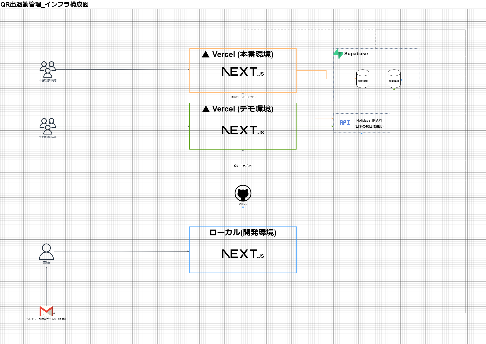
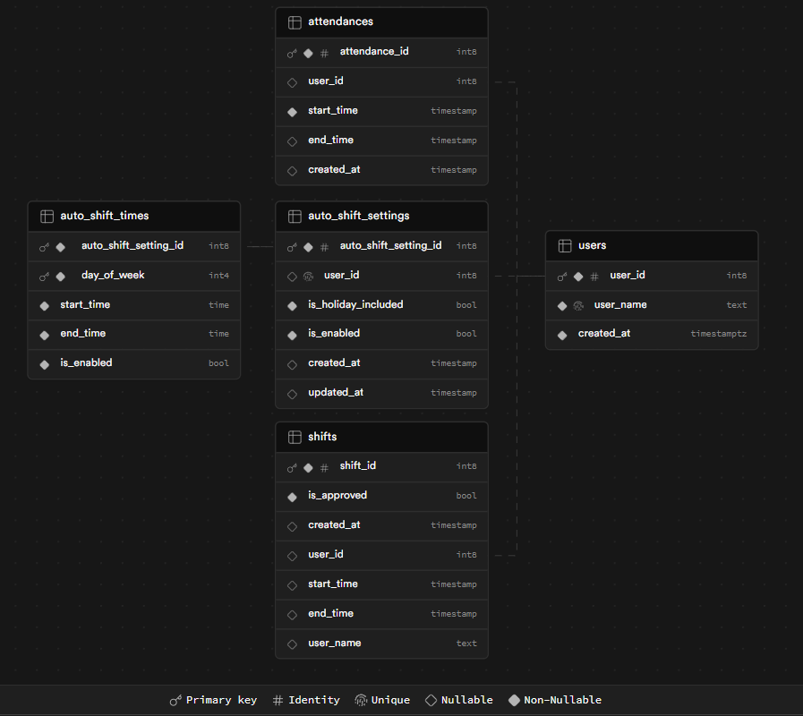

# シフト/出退勤管理アプリ
## 概要
実務案件として納品させていただいたシフト/出退勤の管理アプリとなります。  
利用者数は約20名で現在も運用・保守を行っております。  

本番環境同様の機能をテストいただけますが、データはデモ用となります。 

## デモ用リンク
ユーザー側（スマホ Chrome推奨）  
*QRコードをスマートフォンで読み取ってご利用下さい。  

管理者側（PC Chrome推奨）  
[シフト/出退勤管理アプリ(管理者側)]([https://shift-management-preview.vercel.app/login?role=admin](https://shift-management-preview.vercel.app/admin_login))

## デモ用ユーザー名 / PW
ユーザー名：demo  
サイトパスワード：demo  
管理者パスワード：demo  

## デモ用出退勤打刻用QR

## 使用技術
### 共通
- フレームワーク: Nextjs
- 言語: TypeScript
- テスト: Jest
- 静的解析: ESLint

### フロントエンド（Nextjs）
#### 主要ライブラリ
- FullCalendar（カレンダーUI）
- Material-UI（UI） 
- Zustand（状態管理）
- yudiel/react-qr-scanner（QR読み取り）

### バックエンド（Nextjs + supabase）
### データベース
- supabase

#### 主要ライブラリ
- NextAuth（認証）
- Holidays JP API（祝日用API）
- exceljs（Excel生成用）

### インフラ
- Vercel

#### 利用サービス
- Cron Jobs (シフト固定ユーザーのための自動登録用)
## インフラ構成図

## ER図

## 実装機能一覧
### 共通機能
- ログイン機能

#### 利用者側
- シフト希望提出 / 複数日まとめて提出
- QRコードによる出退勤打刻

#### 管理者側
- 全員のシフト希望確認・変更
- 出退勤の打刻データから勤務時間の自動計算/集計
- 集計された勤務データの編集
- 各種Excelダウンロード

### ユーザー要望により追加された機能
- シフト混雑状況の可視化
- シフト自動登録機能
- 全員のシフト閲覧

### 追加予定の機能
- 会社の休日登録
- お知らせ
- 使い方

## 非ユーザー利用機能
- プロダクション環境テストによる本番環境特有の問題を未然に防ぐ仕組み
- GitHub Actionsによるデプロイ前ビルドエラー検出

## セキュリティ
- middlewareによるページのアクセス制限
- Dependabotによるゼロデイ対策
- HTTPSによる通信の暗号化と改ざん防止
