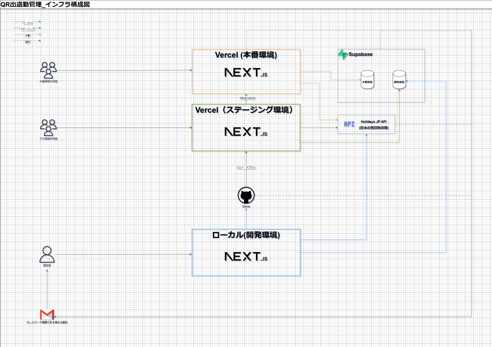

# シフト/出退勤管理アプリ
実務案件として納品したシフト/出退勤のアプリとなります、
利用者数は約20名、現在も運用保守を行っております。

本番環境同様の機能をテストいただけますが、
データなどはデモ用となります。

## デモ用ID / PW
デモ用サイトパスワード：準備中  
デモ用ユーザー名： 準備中  
デモ用管理者パスワード： 準備中  

## デモ用リンク
デモ用ユーザーリンク（スマホ推奨）：  準備中  
デモ用管理者リンク（PC推奨）:  準備中  

## デモ用出退勤打刻QR

## 実装機能一覧
### シフト関連機能
- シフト希望 提出 / まとめて提出 / 毎月自動登録
- シフト混雑状況表示
- シフト表Excelダウンロード

### 出退勤関連機能
- QR読み取りによる出退勤打刻
- 勤務時間集計
- 集計結果Excelダウンロード

## 使用技術
### 共通
- フレームワーク: Nextjs
- 言語: TypeScript
- テスト: Jest
- 静的解析: ESLint

### フロントエンド
- カレンダーUI: FullCalendar
- その他UI: Material-UI
- 状態管理: Zustand
- QR読み取り：yudiel/react-qr-scanner

### バックエンド
- サーバーレス関数: Nextjs API Routes / Server Actions
- データベース: supabase
- 認証: NextAuth
- シフト自動登録用: Vercel Cron Jobs
- 祝日用API: Holidays JP API
- Excel生成用: exceljs

## インフラ構成図

## ER図

